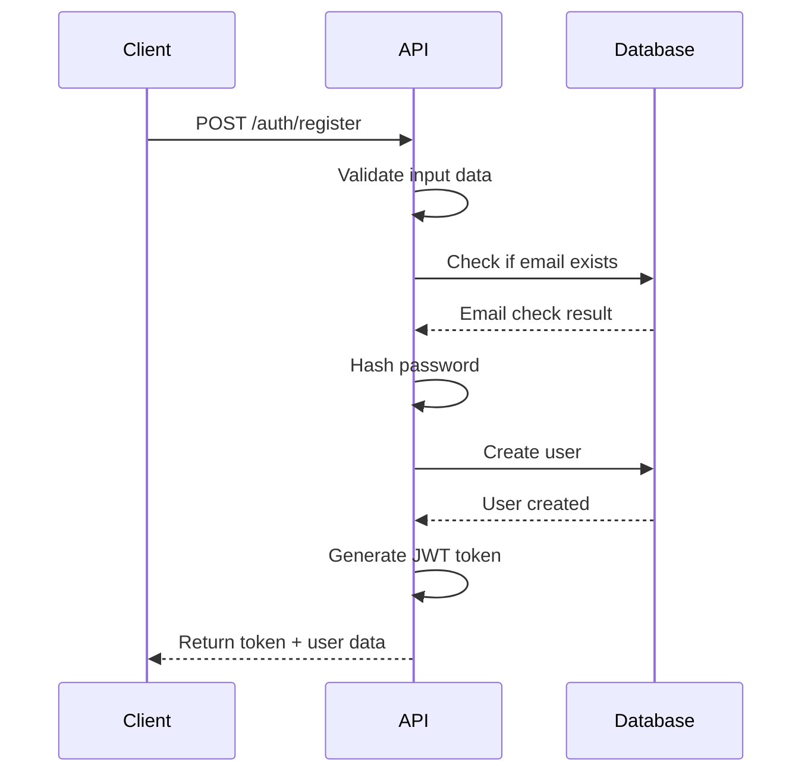
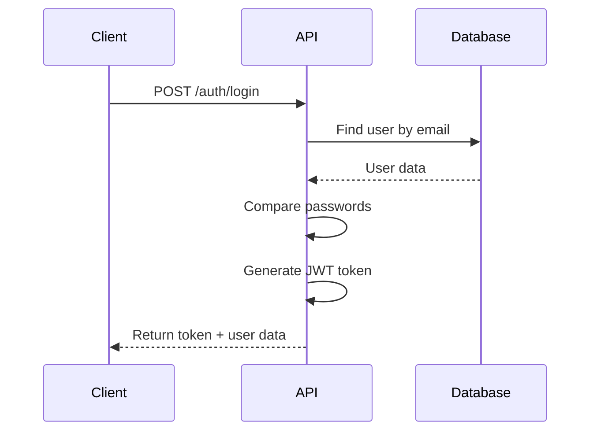
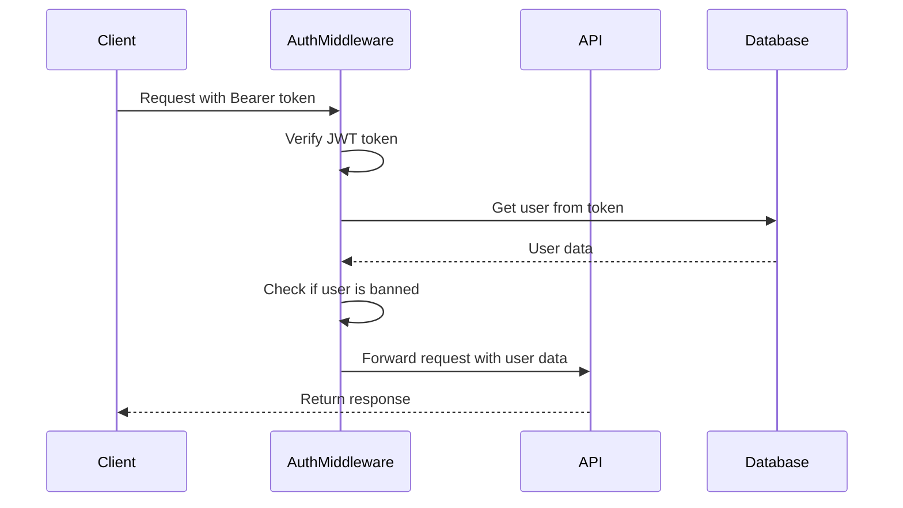

# Authentication & Authorization Documentation

## Overview

The Job Portal API implements comprehensive authentication and authorization using JSON Web Tokens (JWT) and role-based access control (RBAC). This document covers the complete authentication flow, middleware implementation, and security best practices.

## Authentication Flow

### 1. User Registration



### 2. User Login



### 3. Protected Route Access



## JWT Token Structure

### Token Payload

```typescript
interface JwtPayload {
  userId: string;
  email: string;
  role: "admin" | "employer" | "candidate";
  iat: number; // Issued at
  exp: number; // Expires at
}
```

### Token Generation

```typescript
const generateToken = (user: IUser): string => {
  return jwt.sign(
    {
      userId: user._id,
      email: user.email,
      role: user.role,
    },
    process.env.JWT_SECRET!,
    {
      expiresIn: "24h",
      issuer: "job-portal-api",
      audience: "job-portal-client",
    }
  );
};
```

### Token Verification

```typescript
const verifyToken = (token: string): JwtPayload => {
  try {
    return jwt.verify(token, process.env.JWT_SECRET!) as JwtPayload;
  } catch (error) {
    if (error instanceof jwt.TokenExpiredError) {
      throw new AuthorizationError("Token has expired");
    }
    if (error instanceof jwt.JsonWebTokenError) {
      throw new AuthorizationError("Invalid token");
    }
    throw new AuthorizationError("Token verification failed");
  }
};
```

## Middleware Implementation

### Authentication Middleware

Located in `src/middlewares/auth.ts`:

```typescript
export const authenticate = asyncHandler(
  async (req: AuthRequest, res: Response, next: NextFunction) => {
    // Extract token from Authorization header
    const authHeader = req.header("Authorization");
    const token = authHeader?.startsWith("Bearer ")
      ? authHeader.substring(7)
      : null;

    if (!token) {
      throw new AuthorizationError("Access denied. No token provided.");
    }

    try {
      // Verify token
      const decoded = jwt.verify(token, process.env.JWT_SECRET!) as JwtPayload;

      // Get user from database
      const user = await User.findById(decoded.userId).select("-password");

      if (!user) {
        throw new AuthorizationError("Invalid token - user not found.");
      }

      // Check if user is banned
      if (user.isBanned) {
        throw new AuthorizationError("Account has been banned.");
      }

      // Attach user to request object
      req.user = user;
      next();
    } catch (error) {
      if (error instanceof jwt.TokenExpiredError) {
        throw new AuthorizationError("Token has expired.");
      }
      if (error instanceof jwt.JsonWebTokenError) {
        throw new AuthorizationError("Invalid token.");
      }
      throw error;
    }
  }
);
```

### Authorization Middleware

```typescript
export const authorize = (...roles: string[]) => {
  return (req: AuthRequest, res: Response, next: NextFunction) => {
    if (!req.user) {
      throw new AuthorizationError("Authentication required.");
    }

    if (!roles.includes(req.user.role)) {
      throw new AuthorizationError(
        `Access denied. Required role: ${roles.join(" or ")}`
      );
    }

    next();
  };
};
```

### Usage Examples

```typescript
// Authentication only
router.get("/profile", authenticate, getProfile);

// Authentication + specific role
router.get("/admin/users", authenticate, authorize("admin"), getAllUsers);

// Authentication + multiple roles
router.post("/jobs", authenticate, authorize("employer", "admin"), createJob);
```

## Role-Based Access Control (RBAC)

### Role Definitions

#### Admin Role

- **Permissions**: Full system access
- **Capabilities**:
  - View all users, jobs, and applications
  - Ban/unban users
  - Delete users and associated data
  - Access system statistics
  - Override all permissions

#### Employer Role

- **Permissions**: Job and application management
- **Capabilities**:
  - Create, update, and delete own jobs
  - View applications for own jobs
  - Update application status
  - View own profile and statistics

#### Candidate Role

- **Permissions**: Application management
- **Capabilities**:
  - View all active jobs
  - Submit applications
  - View own applications
  - Update own profile

### Permission Matrix

| Resource                  | Admin | Employer | Candidate |
| ------------------------- | ----- | -------- | --------- |
| **Users**                 |
| View all users            | ✅    | ❌       | ❌        |
| Ban/unban users           | ✅    | ❌       | ❌        |
| Delete users              | ✅    | ❌       | ❌        |
| **Jobs**                  |
| View all jobs             | ✅    | ✅       | ✅        |
| Create jobs               | ✅    | ✅       | ❌        |
| Update own jobs           | ✅    | ✅       | ❌        |
| Delete own jobs           | ✅    | ✅       | ❌        |
| Update any jobs           | ✅    | ❌       | ❌        |
| **Applications**          |
| View all applications     | ✅    | ❌       | ❌        |
| View job applications     | ✅    | ✅\*     | ❌        |
| View own applications     | ✅    | ✅       | ✅        |
| Submit applications       | ❌    | ❌       | ✅        |
| Update application status | ✅    | ✅\*     | ❌        |

\*Only for jobs created by the employer

### Dynamic Permission Checking

```typescript
export const checkJobOwnership = asyncHandler(
  async (req: AuthRequest, res: Response, next: NextFunction) => {
    const { id } = req.params;
    const user = req.user!;

    // Admin can access any job
    if (user.role === "admin") {
      return next();
    }

    // Find the job
    const job = await Job.findById(id);
    if (!job) {
      throw new NotFoundError("Job not found");
    }

    // Check if user owns the job
    if (job.createdBy.toString() !== user._id.toString()) {
      throw new AuthorizationError("You can only access your own jobs");
    }

    next();
  }
);
```

## Password Security

### Password Hashing

```typescript
// Pre-save middleware for password hashing
UserSchema.pre("save", async function (next) {
  // Only hash if password is modified
  if (!this.isModified("password")) {
    return next();
  }

  try {
    // Generate salt and hash password
    const saltRounds = 12;
    this.password = await bcrypt.hash(this.password, saltRounds);
    next();
  } catch (error) {
    next(error);
  }
});
```

### Password Comparison

```typescript
// Instance method for password comparison
UserSchema.methods.comparePassword = async function (
  candidatePassword: string
): Promise<boolean> {
  return await bcrypt.compare(candidatePassword, this.password);
};

// Usage in login controller
const isValidPassword = await user.comparePassword(password);
if (!isValidPassword) {
  throw new AuthorizationError("Invalid credentials");
}
```

### Password Validation

```typescript
export const validatePassword = (password: string): string[] => {
  const errors: string[] = [];

  if (password.length < 8) {
    errors.push("Password must be at least 8 characters long");
  }

  if (!/[a-z]/.test(password)) {
    errors.push("Password must contain at least one lowercase letter");
  }

  if (!/[A-Z]/.test(password)) {
    errors.push("Password must contain at least one uppercase letter");
  }

  if (!/\d/.test(password)) {
    errors.push("Password must contain at least one number");
  }

  if (!/[!@#$%^&*(),.?":{}|<>]/.test(password)) {
    errors.push("Password must contain at least one special character");
  }

  return errors;
};
```

## Session Management

### Token Refresh Strategy

```typescript
export const refreshToken = asyncHandler(
  async (req: AuthRequest, res: Response) => {
    const { refreshToken } = req.body;

    if (!refreshToken) {
      throw new AuthorizationError("Refresh token required");
    }

    try {
      const decoded = jwt.verify(
        refreshToken,
        process.env.REFRESH_TOKEN_SECRET!
      ) as JwtPayload;
      const user = await User.findById(decoded.userId);

      if (!user || user.isBanned) {
        throw new AuthorizationError("Invalid refresh token");
      }

      const newToken = generateToken(user);
      const newRefreshToken = generateRefreshToken(user);

      res.json({
        token: newToken,
        refreshToken: newRefreshToken,
        user: {
          id: user._id,
          email: user.email,
          role: user.role,
        },
      });
    } catch (error) {
      throw new AuthorizationError("Invalid refresh token");
    }
  }
);
```

### Token Blacklisting

```typescript
// Redis-based token blacklisting
const blacklistedTokens = new Set<string>();

export const blacklistToken = (token: string) => {
  blacklistedTokens.add(token);
  // In production, use Redis with expiration
  // redisClient.setex(token, 86400, 'blacklisted');
};

export const isTokenBlacklisted = (token: string): boolean => {
  return blacklistedTokens.has(token);
  // In production, check Redis
  // return await redisClient.exists(token);
};
```

## Security Best Practices

### 1. JWT Secret Management

```typescript
// Use strong, random secrets
const JWT_SECRET =
  process.env.JWT_SECRET || crypto.randomBytes(64).toString("hex");

// Rotate secrets regularly
const rotateJWTSecret = () => {
  const newSecret = crypto.randomBytes(64).toString("hex");
  // Update environment and restart service
};
```

### 2. Rate Limiting

```typescript
import rateLimit from "express-rate-limit";

// Authentication rate limiting
export const authRateLimit = rateLimit({
  windowMs: 15 * 60 * 1000, // 15 minutes
  max: 5, // limit each IP to 5 requests per windowMs
  message: "Too many authentication attempts, please try again later",
  standardHeaders: true,
  legacyHeaders: false,
});

// Apply to auth routes
router.use("/auth", authRateLimit);
```

### 3. Input Validation

```typescript
import { body, validationResult } from "express-validator";

export const validateRegistration = [
  body("email")
    .isEmail()
    .normalizeEmail()
    .withMessage("Please provide a valid email"),
  body("password")
    .isLength({ min: 8 })
    .withMessage("Password must be at least 8 characters")
    .matches(/^(?=.*[a-z])(?=.*[A-Z])(?=.*\d)(?=.*[@$!%*?&])[A-Za-z\d@$!%*?&]/)
    .withMessage(
      "Password must contain uppercase, lowercase, number, and special character"
    ),
  body("role")
    .isIn(["admin", "employer", "candidate"])
    .withMessage("Role must be admin, employer, or candidate"),
];
```

### 4. CORS Configuration

```typescript
import cors from "cors";

const corsOptions = {
  origin: process.env.FRONTEND_URL || "http://localhost:3000",
  credentials: true,
  optionsSuccessStatus: 200,
  methods: ["GET", "POST", "PUT", "DELETE"],
  allowedHeaders: ["Content-Type", "Authorization"],
};

app.use(cors(corsOptions));
```

### 5. HTTPS Enforcement

```typescript
// Force HTTPS in production
const enforceHTTPS = (req: Request, res: Response, next: NextFunction) => {
  if (
    process.env.NODE_ENV === "production" &&
    req.header("x-forwarded-proto") !== "https"
  ) {
    return res.redirect(`https://${req.header("host")}${req.url}`);
  }
  next();
};
```

## Testing Authentication

### Unit Tests

```typescript
describe("Authentication Middleware", () => {
  it("should authenticate valid token", async () => {
    const user = await User.create({
      email: "test@example.com",
      password: "password123",
      role: "candidate",
    });

    const token = generateToken(user);

    const req = {
      header: jest.fn().mockReturnValue(`Bearer ${token}`),
    } as any;

    const res = {} as any;
    const next = jest.fn();

    await authenticate(req, res, next);

    expect(req.user).toBeDefined();
    expect(req.user.email).toBe("test@example.com");
    expect(next).toHaveBeenCalled();
  });

  it("should reject invalid token", async () => {
    const req = {
      header: jest.fn().mockReturnValue("Bearer invalid-token"),
    } as any;

    const res = {} as any;
    const next = jest.fn();

    await expect(authenticate(req, res, next)).rejects.toThrow("Invalid token");
  });
});
```

### Integration Tests

```typescript
describe("Authentication Integration", () => {
  it("should register and login user", async () => {
    // Register
    const registerResponse = await request(app)
      .post("/api/auth/register")
      .send({
        email: "test@example.com",
        password: "Password123!",
        role: "candidate",
      });

    expect(registerResponse.status).toBe(201);
    expect(registerResponse.body.token).toBeDefined();

    // Login
    const loginResponse = await request(app).post("/api/auth/login").send({
      email: "test@example.com",
      password: "Password123!",
    });

    expect(loginResponse.status).toBe(200);
    expect(loginResponse.body.token).toBeDefined();

    // Access protected route
    const profileResponse = await request(app)
      .get("/api/auth/profile")
      .set("Authorization", `Bearer ${loginResponse.body.token}`);

    expect(profileResponse.status).toBe(200);
    expect(profileResponse.body.user.email).toBe("test@example.com");
  });
});
```

## Common Security Issues and Solutions

### 1. JWT Token Theft

**Problem**: Tokens can be stolen via XSS or other attacks

**Solutions**:

- Use secure HTTP-only cookies for sensitive applications
- Implement token rotation
- Use short expiration times
- Implement token blacklisting

### 2. Brute Force Attacks

**Problem**: Attackers can try multiple password combinations

**Solutions**:

- Implement rate limiting
- Account lockout after failed attempts
- CAPTCHA for repeated failures
- Monitor and alert on suspicious activity

### 3. Privilege Escalation

**Problem**: Users might try to access unauthorized resources

**Solutions**:

- Always verify user permissions
- Use least privilege principle
- Implement proper role checks
- Log all authorization attempts

### 4. Session Fixation

**Problem**: Attackers can hijack user sessions

**Solutions**:

- Generate new tokens after login
- Use secure session management
- Implement proper logout functionality
- Monitor concurrent sessions

This comprehensive authentication and authorization system provides robust security for the Job Portal API while maintaining usability and performance.
